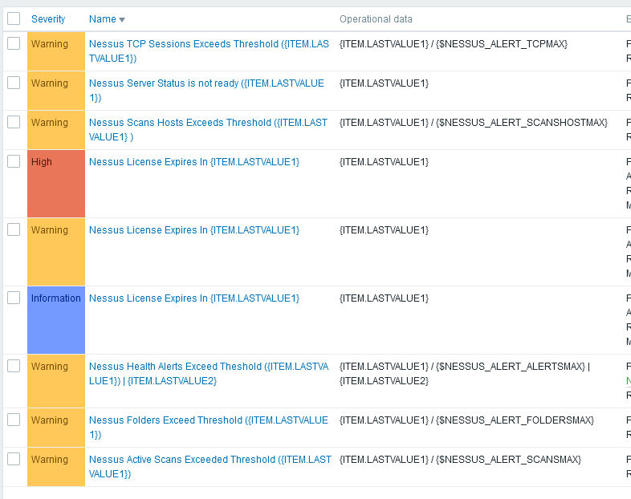

# Zabbix_Nessus-Professional_Monitoring
Zabbix Nessus Professional Monitor (API)

## Background 
This template is used to monitor and alert on a Nessus Professional Installation.

## Installation
- Import Zabbix_Nessus_Professional_API.yaml
- Create new Host
- Assign Template "Nessus Professional Monitor" to Host
- Set Macro {$NESSUS_ACCESSKEY} to your Nessus API Access Key (Can be created within Nessus web GUI)
- Set Macro {$NESSUS_SECRETKEY} to your Nessus API Secret Key (Can be created within Nessus web GUI)
- Set Macro {$NESSUS_HOST} to your Nessus Host URL  Key
- Add an agent host (can be left blank, only necessary to allow HTTP Agent to operate).  The data is collected by the Zabbix Serer or Proxy.

## Methodology
- Pulls Data from Nessus Professional API

## Features
- Monitors and stuff

## Details
- 58 Items
- 9 Triggers
- 10 Graphs
- 2 Dashboard
- 9 macros

## Triggers
- Active Hosts scanned > threshold
- Active scans > threshold
- Active TCP Sessions > threshold
- License Expires in xx days
- Server Status not ready

# Screenshots

Dashboard - Active Scans and Active Scan Hosts (7 days)

Dashboard - Network Traffic (7 days)

Dashboard - TCP Sessions (7 days)

Dashboard - Folder Count (7 days)

Dashboard - Nessus Process CPU Util (7 days)

Dashboard - Nessus Versioning 

Dashboard - Nessus DNS Stats

Dashboard - Active Health Alerts 

Dashboard - Nessus License Expiry Approach

Dashboard - Nessus Professional License Information

Triggers 

Graphs

## Known Limitations & Issues
- 

## Contact
@Krelkci (twitter)   @ Relkci (Github)

## License
Apache 2

## Thanks
Black Hills Information Security https://www.blackhillsinfosec.com
